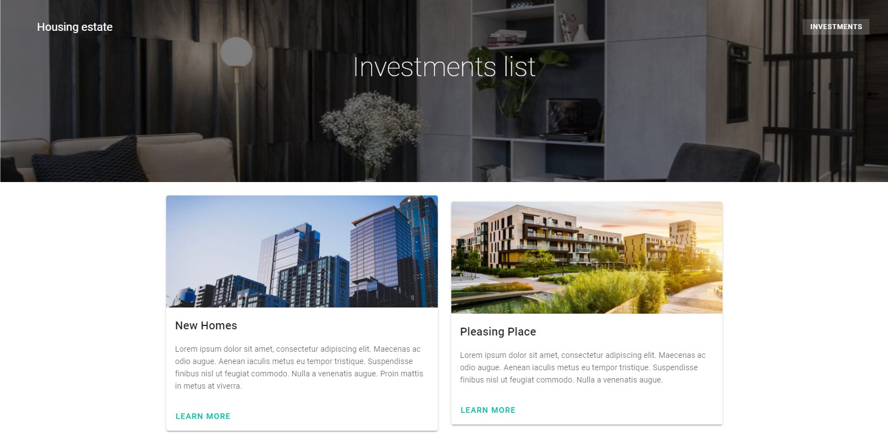
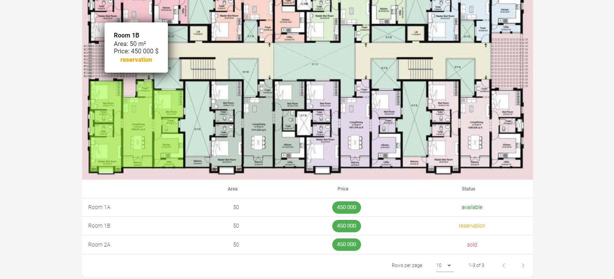
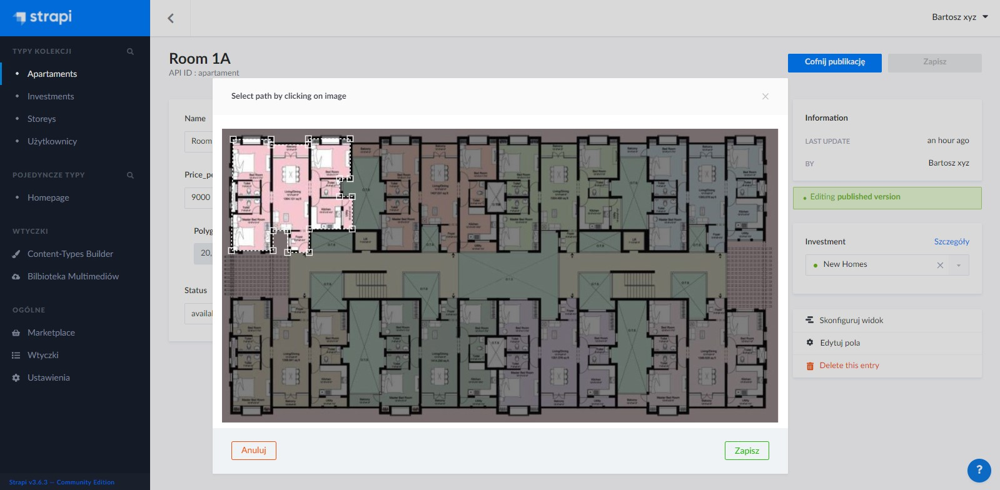

# Residential-area-website

Expermimental SSR app for house estate company made with **Nuxt** and **Strapi**.

## Preview







## Get started

- Clone this repo:

```bash
git clone https://github.com/akcyp/residential-area-website
```

- Install dependencies:

```bash
cd frontend && npm install
cd ..
cd backend && npm install
cd ..
```

- Run backend and frontend (in diffirend consoles)

```bash
# Console #1
cd frontend && npm run start
# Console #2
cd backend && npm run start
```
