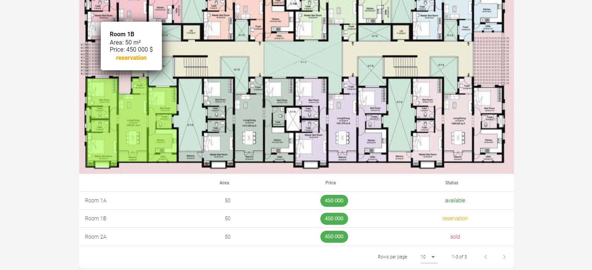
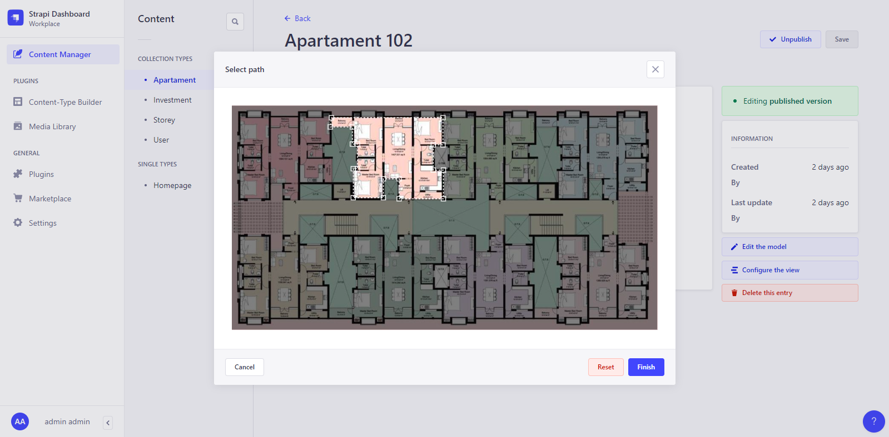
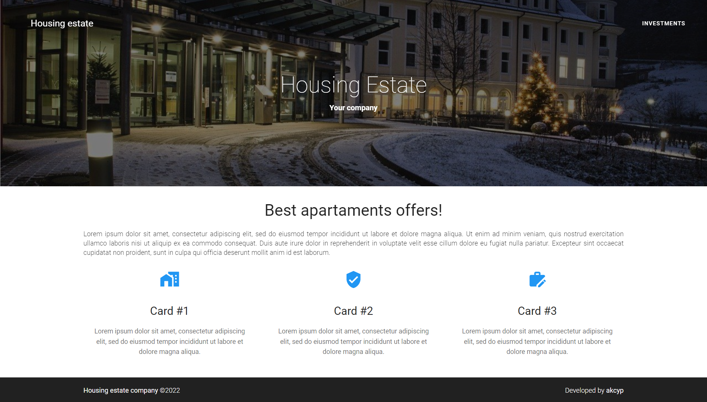
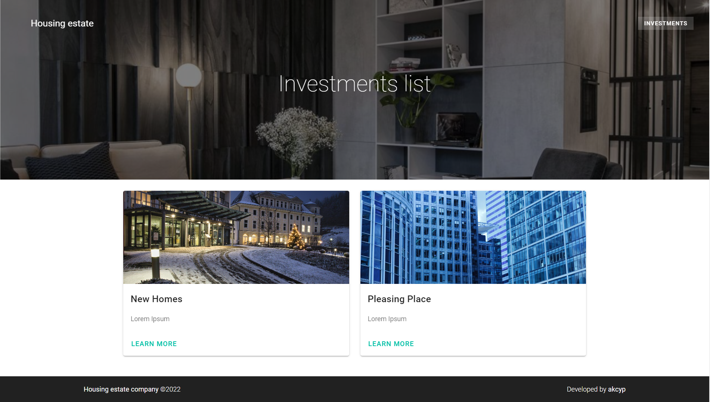
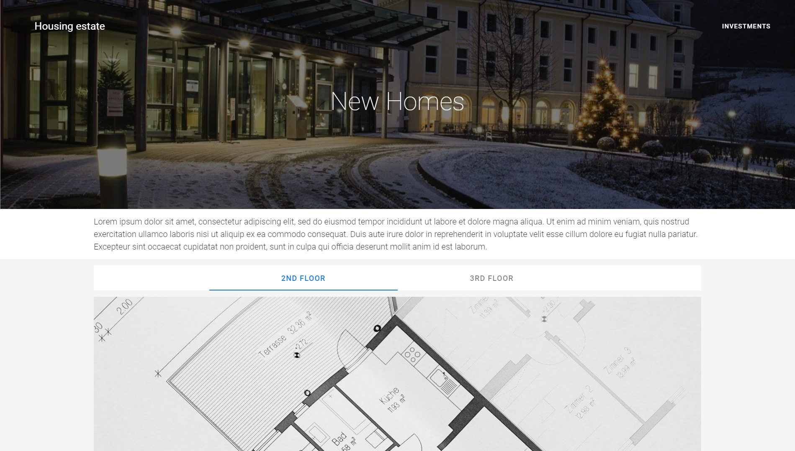
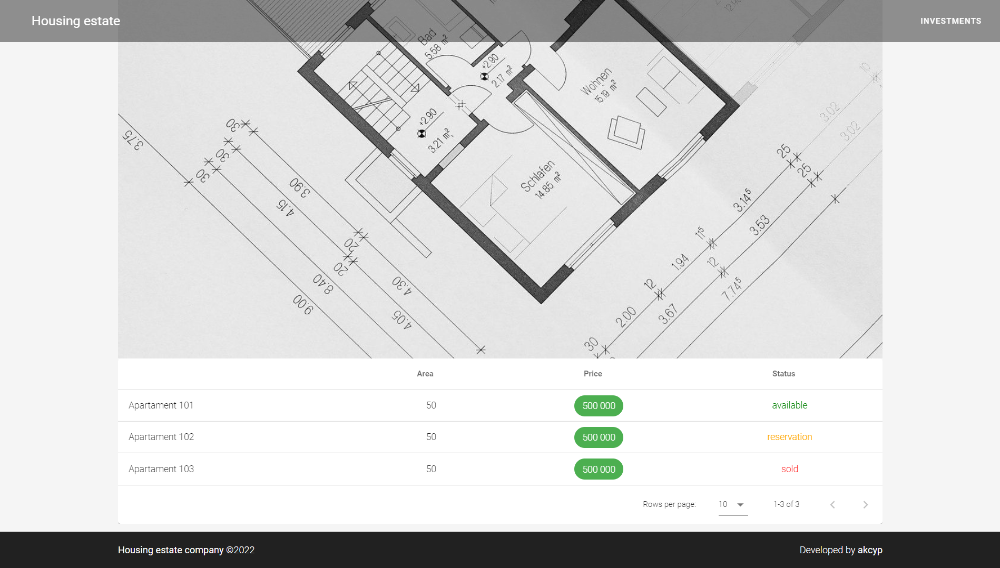

# Residential-area-website

Expermimental SSR app for house estate company made with **Nuxt** and **Strapi**.

## Preview






## Get started

- Clone this repo:

```bash
git clone https://github.com/akcyp/residential-area-website
```

- Docker auto install:

```bash
cd residential-area-website
sudo docker-compose up --build
```

- Frontend side: [http://localhost/](http://localhost/)

- API: [http://localhost/api/](http://localhost/api/)

- Admin panel: [http://localhost/admin/](http://localhost/admin/)
  - > Username: test@null.com \
    > Password: Admin123


# Gallery







